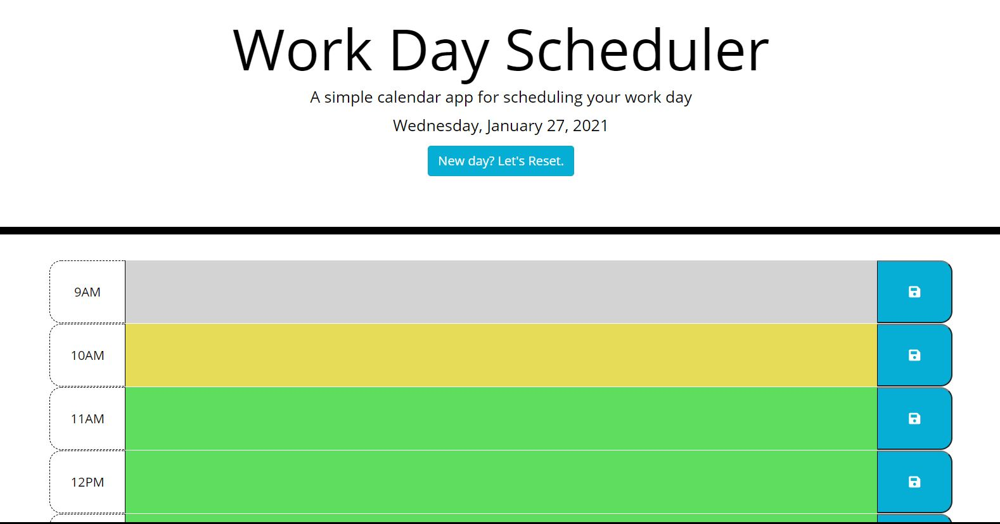
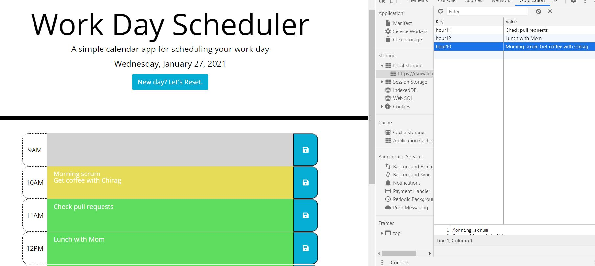
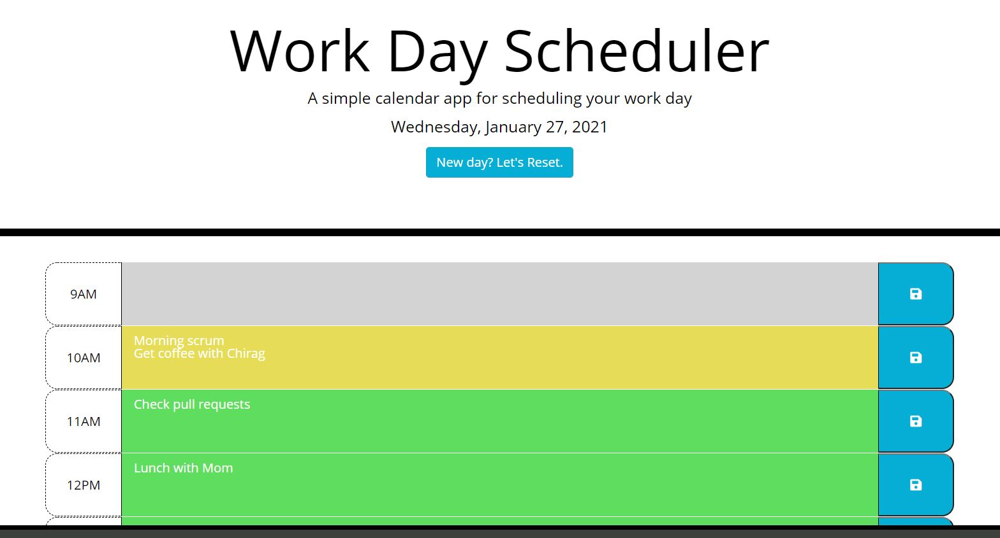
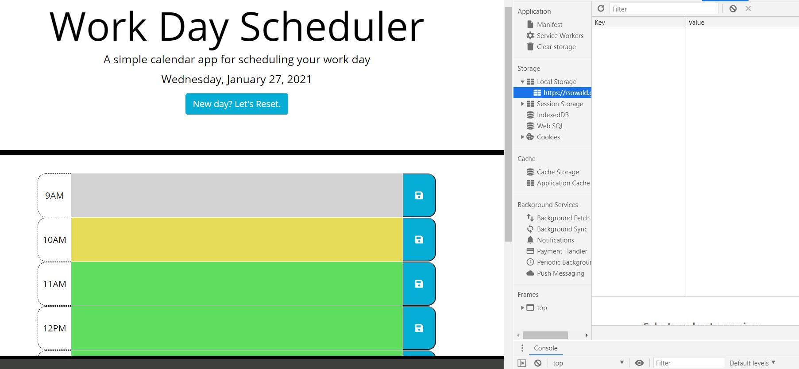

# WeeklyPlanner
[View deployed application](https://rsowald.github.io/WorkDayPlanner)

## About This Project
This is a simple planner that allows a user to save notes, to-dos, or event reminders for each hour in standard business hours. It is color-coded so that, at a glance, the user can see hour blocks that are already past, what they have going on in the current hour, and what is still upcoming in the work day.
The application utilizes the day.js library to set the date to the top of the page and get a time for comparison to set the color-coding to the time blocks. Each time block is set as a text area with built in scrollable ability if there are more than three entries in the block. The save button on each row saves the content of the respective time block to local storage independently from the other blocks. On refresh, the content is pulled from local storage and rendered once again to the appropriate time block.
I have also included a refresh button at the top of the page. I had originally planned to write a function that saved the current day to local storage and compared it to the date at the next initialization to clear all content if they didn't match. However, many users would probably have recurring daily events that they would prefer persist from day to day. So, the refresh button gives them the option to start with a blank slate.

## Usage
The application loads on an empty color-coded schedule with time blocks for standard business hours 9am-5pm. Grey blocks are time periods that have already passed. The yellow block is the current hour. The green blocks are future hour periods.

When new entries are created in a time block, they can be saved to local storage by clicking the save button on the corresponding row.

Even if the user navigates away from the page or just refreshes, the entries will persist until a blank field is saved or the reset button is clicked.

When the reset button is clicked, all time blocks are cleared and local storage is emptied.

## Future Features
- Timers on each time block >= current hour to dynamically change color on the hour even if the page was not refreshed.
- Warning alert if the user tries to navigate away from the page without saving entries